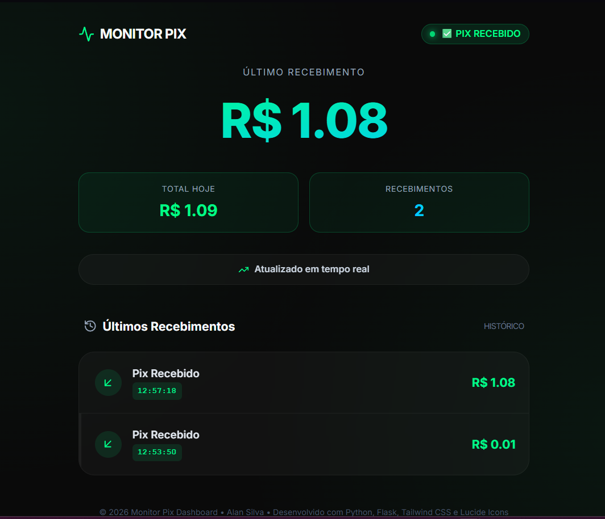

# 🚀 Monitor Pix - Dashboard PWA em Tempo Real

<p align="center">
  
</p>

<p align="center">
    
    
    
    
</p>

Um dashboard profissional e moderno para monitorar recebimentos via Pix através da API do Mercado Pago, agora com suporte a **PWA (Progressive Web App)** para instalação em desktops e dispositivos móveis.

## ✨ Funcionalidades Principais

-   **Dashboard em Tempo Real:** Atualização automática a cada 3 segundos para exibir novos pagamentos instantaneamente.
-   **Design Moderno e Responsivo:** Interface com efeito *glassmorphism* construída com Tailwind CSS, totalmente adaptável a desktops, tablets e celulares.
-   **PWA (Progressive Web App):** Instale o dashboard como um aplicativo nativo no seu computador ou celular para acesso rápido e funcionamento offline.
-   **Total Acumulado:** Visualize o valor total recebido no dia, atualizado a cada novo Pix.
-   **Histórico Detalhado:** Acompanhe os 10 últimos pagamentos com valor e horário exato da transação.
-   **Tratamento de Erros:** Gerenciamento robusto de falhas de conexão com a API, timeouts e outros erros, garantindo que o sistema continue funcionando.
-   **Logging Detalhado:** Logs completos no console para fácil depuração e acompanhamento das atividades do servidor.

## 🛠️ Tecnologias Utilizadas

| Categoria  | Tecnologia                                                                                                                              | Descrição                                                                 |
| :--------- | :-------------------------------------------------------------------------------------------------------------------------------------- | :------------------------------------------------------------------------ |
| **Backend**  |                                | Linguagem principal para a lógica do servidor.                            |
|            |                                      | Micro-framework para criar a aplicação web e a API.                       |
| **Frontend** |                                            | Estrutura semântica do dashboard.                                         |
|            |                      | Framework CSS para estilização rápida e moderna.                          |
|            |                                | Para registro do Service Worker e atualização da página.                  |
| **API**      |                        | API utilizada para consultar os pagamentos.                               |
| **PWA**      |  &  | Para funcionamento offline e instalação do aplicativo.                    |

## 🚀 Guia de Instalação e Uso

Siga os passos abaixo para configurar e executar o projeto em seu ambiente local.

### Pré-requisitos

-   Python 3.7 ou superior
-   `pip` (gerenciador de pacotes do Python)
-   Um **Token de Acesso** da sua aplicação no [Painel de Desenvolvedores do Mercado Pago](https://www.mercadopago.com.br/developers/panel).

### 1. Clone o Repositório

```bash
git clone https://github.com/seu-usuario/monitor-pix.git
cd monitor-pix
```

### 2. Crie um Ambiente Virtual (Recomendado)

```bash
# Para Linux/macOS
python3 -m venv venv
source venv/bin/activate

# Para Windows
python -m venv venv
.\venv\Scripts\activate
```

### 3. Instale as Dependências

```bash
pip install -r requirements.txt
```

### 4. Configure seu Token de Acesso

Abra o arquivo `app.py` e substitua o valor da variável `ACCESS_TOKEN` pelo seu token de produção do Mercado Pago.

```python
# Linha 15 em app.py
ACCESS_TOKEN = "SEU_TOKEN_DE_ACESSO_AQUI"
```

### 5. Execute a Aplicação

```bash
python app.py
```

O servidor será iniciado e você verá uma mensagem de confirmação no console. Agora, basta acessar **`http://localhost:5000`** no seu navegador.

## 📲 Instalando como um Aplicativo (PWA)

Você pode instalar o Monitor Pix como um aplicativo para ter acesso rápido e uma experiência mais integrada.

-   **No Desktop (Chrome/Edge):** Acesse `http://localhost:5000` e clique no ícone de "Instalar" que aparece na barra de endereços.
-   **No Celular (Android/iOS):** Acesse o site pelo navegador, abra o menu de opções e selecione **"Adicionar à tela de início"** ou **"Instalar Aplicativo"**.

<p align="center">
  
</p>

## 📁 Estrutura do Projeto

```
/monitor-pix
├── app.py                 # Lógica do servidor Flask e monitoramento da API
├── requirements.txt       # Dependências Python do projeto
├── .gitignore             # Arquivos e pastas a serem ignorados pelo Git
├── README.md              # Este arquivo de documentação
├── /templates
│   └── index.html         # Arquivo HTML principal com Jinja2 e Tailwind CSS
└── /static
    ├── manifest.json      # Configurações do PWA (ícones, nome, cores)
    └── service-worker.js  # Script para cache e funcionamento offline
```

## 🔌 Endpoint da API

O projeto também expõe uma API simples para consulta de status.

-   **`GET /api/status`**: Retorna um JSON com o status atual, último valor, total do dia e histórico.

**Exemplo de Resposta:**
```json
{
  "status": "✅ PIX RECEBIDO",
  "valor": "R$ 150.00",
  "total_dia": "R$ 1500.50",
  "historico": [
    { "valor": "150.00", "hora": "14:30:15" },
    { "valor": "100.00", "hora": "14:25:02" }
  ],
  "timestamp": "2024-03-15T14:30:15.123456"
}
```

## 🛡️ Tratamento de Erros

O sistema foi projetado para ser resiliente. O status exibido no dashboard mudará para indicar problemas:

-   **⚠️ Conexão lenta:** Se a API do Mercado Pago demorar a responder.
-   **❌ Sem conexão:** Se não for possível alcançar os servidores da API.
-   **❌ Erro na API:** Se a API retornar um erro (ex: token inválido).
-   **❌ Erro no sistema:** Para qualquer outra falha inesperada.

## 📄 Licença

Este projeto é distribuído sob a licença MIT. Veja o arquivo `LICENSE` para mais detalhes.

---

<p align="center">
  Desenvolvido com ❤️ para simplificar o monitoramento de seus recebimentos.
</p>
